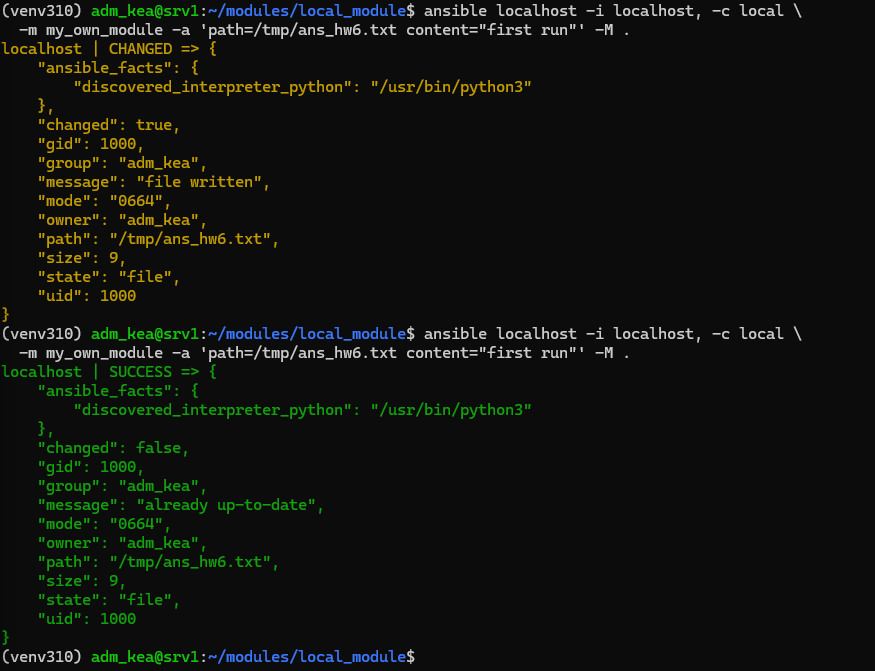
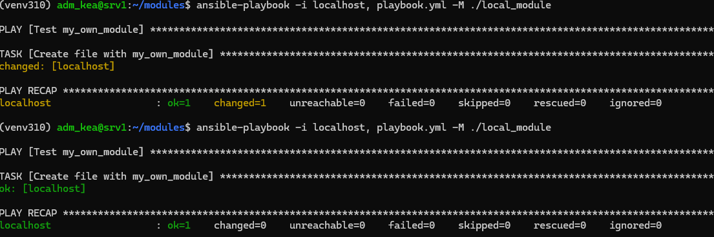
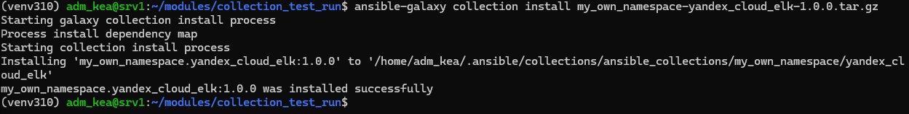
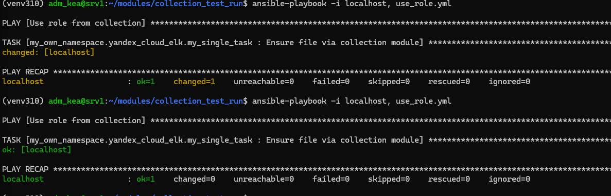

# Домашнее задание к занятию 6 «Создание собственных модулей» - Крюков Егор

## Ссылки 
[tar.gz архив](https://github.com/n0rthf1ght3r/modules/blob/7f5c9cf9363aee580ba06de98aa221d6182a758d/my_own_namespace/yandex_cloud_elk/my_own_namespace-yandex_cloud_elk-1.0.0.tar.gz)

[collection](https://github.com/n0rthf1ght3r/modules/tree/7f5c9cf9363aee580ba06de98aa221d6182a758d/my_own_namespace/yandex_cloud_elk)
# Скриншоты
## Пункт 4 
 
## Пункт 6

## Пункт 15

## Пункт 16

